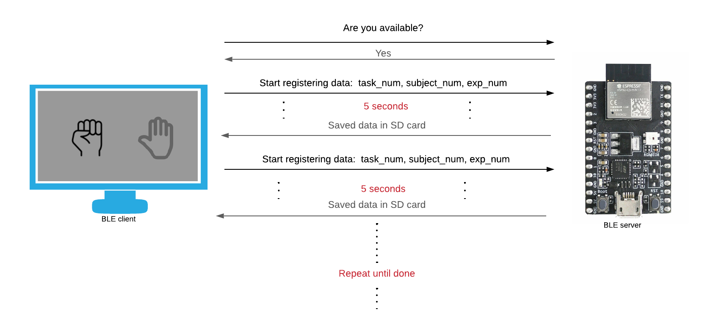
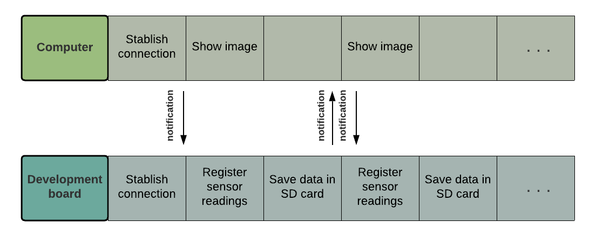
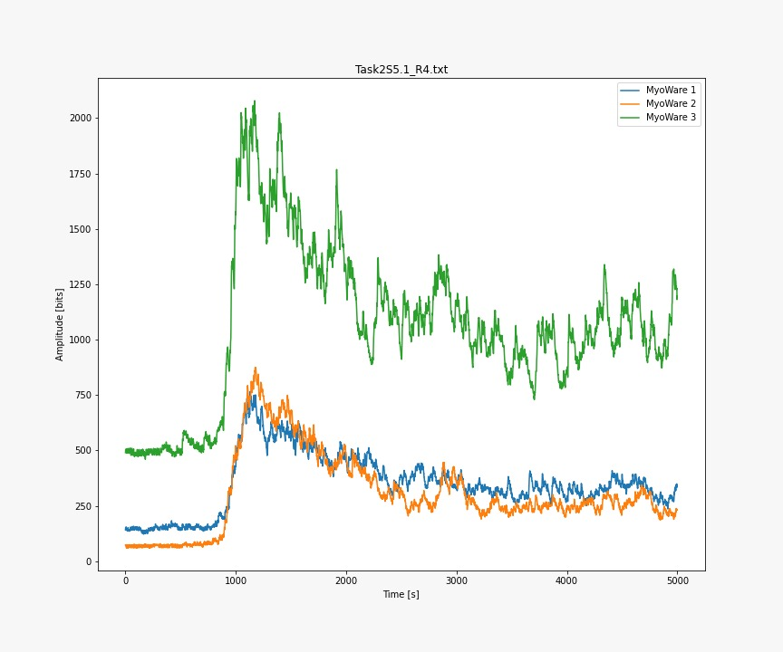
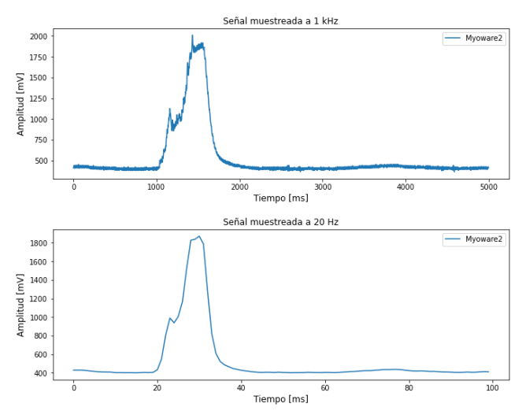
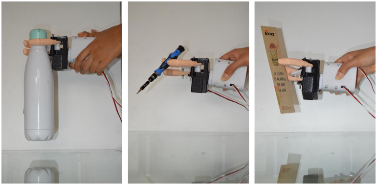

# EMG Signal Classification
 

## Introduction
This project aims to preprocess EMG signals and classify them into three classes using AI techniques to control a 3d printed prosthesis.

### Tools:
- [ESP32 C3](https://www.espressif.com/en/products/socs/esp32-c3)
- [MyoWare sensors](https://cdn.sparkfun.com/datasheets/Sensors/Biometric/MyowareUserManualAT-04-001.pdf)
- Servo motors
- [SD card module](https://create.arduino.cc/projecthub/electropeak/sd-card-module-with-arduino-how-to-read-write-data-37f390)
- Computer

## Data collection

For this stage, a computer, running a python script and an Esp32c3, communicated using bluetooth low energy (BLE). The computer was in charge of showing on the screen when the test subject had to start performing a certain muscular action. The esp32c3 was in charge of recording the emg data using 3 MyoWare sensors, labeling it and saving it on an SD card. <\br>

### Screen visuals
The experiment shows visual signs to let the subject jnow when to perform certain actions.

Note: the ideal would be to send the data via bluetooth to the laptop, however we were unable to find a way to do this quickly without affecting the data recording which was done at 1kHz. 

## Preprocessing
Preprocessing data is an important step, specially when working with biological signals.

### Filtering
To filter out the noise we used the RMS Envelope technique, which was calculated in a 50 ms wide window.

### Normalization
The peak dynamic method was used, which consists on representing each signal as a ratio of the peak value of that time window. Values were kept between [0, 1] .

### Feature extraction
Two approaches were analyzed:
1. Statistical features (Refer to EEG ignal classification github)
2. RMS in time windows: extracting the rms value in subwindows.

Refer to: 

## Training and converting the TF model to a TF Lite model
A tensorflow model was trained and the converted into a TF Lite model. 

## Deploying model and testing it on real-time.
The whole pipeline was deployed on a ESP-C3 development board. The code was written in C# and the model output was used to activate the servo motors to move a prosthesis. 

